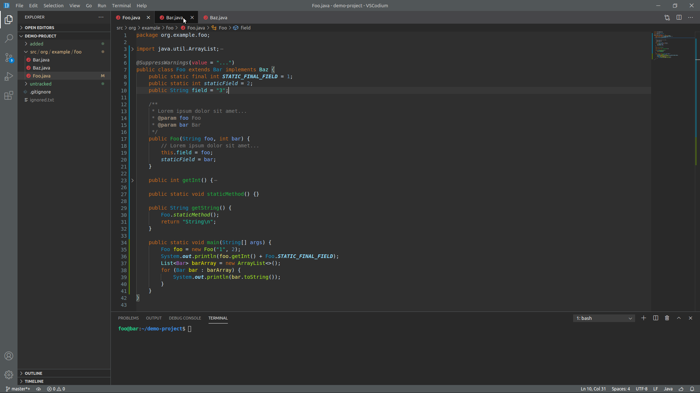

# Familiar Java Themes
This extension brings back the default color themes from your favorite Java IDEs,
such as **[Eclipse][1]** and **[IntelliJ IDEA][2]**! Currently a work in progress,
as syntax highlighting has only a been implemented for a few Java-related languages.

## Screenshots
*The screenshots below are taken with the [configuration tips][3] applied.*
<details>
  <summary>Eclipse Dark theme</summary>

  
</details>
<details>
  <summary>Eclipse Light theme</summary>

  
</details>
<details>
  <summary>IntelliJ Dark theme</summary>

  

  
</details>
<details>
  <summary>IntelliJ Light theme</summary>

  

  
</details>
<details>
  <summary>IntelliJ Light (Classic) theme</summary>

   theme")

   theme")
</details>

## Features
- Editor themes
  - Eclipse Dark
  - Eclipse Light
  - IntelliJ Dark (also known as "Darcula")
  - IntelliJ Light
  - IntelliJ Light (Classic)
- Matching themes for syntax highlighting
  - Support for **[semantic highlighting][4]**
  - Java syntax highlighting
  - XML syntax highlighting
  - JSON syntax highlighting
  - YAML syntax highlighting
  - Markdown syntax highlighting
  - EditorConfig syntax highlighting
  - More languages coming soon...
- Configuration helper to easily match the IntelliJ visuals

# Installing
### The extension can be installed from:
- [Visual Studio Marketplace][5]
- [Open VSX Registry][6]

### After installation
Select your preferred color theme from the VS Code settings, and optionally see
[configuration tips][3] for best results.

# Configuration tips
## General
It is **highly recommended** to use the semantic highlighting feature provided by version `0.69.0` or higher of the
[Language Support for Java(TM) by Red Hat][7] extension, in order to get the best results for Java syntax highlighting.
Previous versions of the Java extension do not provide all of the highlighting rules used by this theme extension.

Semantic highlighting for Java is controlled by the following VS Code settings:
- `editor.semanticHighlighting.enabled`
  - Defaults to true.
- `java.semanticHighlighting.enabled`
  - Defaults to true in since version `0.66.0` of the Language Support for Java extension.
  - If you installed an earlier version of the Java extension, it's possible that this setting is still disabled.
  - You may need to restart VS Code after changing this setting in order for it to take effect.

Note that Semantic Highlighting needs to be computed by the Java Language Server,
which means that it comes with a slight delay and may not be immediately available when starting VS Code.

## IntelliJ themes
If you are used to IntelliJ IDEA, there are a couple of extra steps you can take
to make yourself feel at home. Note that these are just further configuration tips,
the color theme will work just fine without them.

#### Step 1: Install the JetBrains Mono font
The default font in IntelliJ IDEA is JetBrains Mono, which is quite different from
the default font in VS Code. If you want to use the JetBrains Mono font in VS Code,
you can follow [the instructions][8] for downloading and installing the font on your system.

#### Step 2: Configure font rendering and other visuals
Even if you were to use the JetBrains Mono font in VS Code, you might notice some
differences in how the font is rendered. The default settings in IntelliJ IDEA are
`16` for the font size and `1.2` for the line spacing. However, these values are not
calculated the same way in VS Code, which makes it tedious to match IDEA's font settings.
In addition, there are some visual features in IDEA that VS Code supports, but are
disabled by default and must be enabled manually in the settings.

In order to make your life easier, this extension provides the `Familiar Java Themes: Configuration Helper`
command, which can be found in the command palette (`Ctrl` + `Shift` + `P`). The command
automatically changes the correct VS Code settings to match the font and visual settings in IDEA.
It also gives you the ability to preview the changes, to see if you like them or not.
Note that even though the command tells VS Code to use the JetBrains Mono font, you still
have to install the font to your system yourself, via the intstructions in the step above.

If you prefer to tweak the settings yourself, you can find a detailed list of the settings
changed in the spoiler below.

<details>
  <summary>Settings changed by the configuration helper</summary>

  ```js
  {
    // Match IDEA's font settings for the editor
    "editor.fontFamily": "'JetBrains Mono'",
    "editor.fontSize": 16,
    "editor.lineHeight": 26,
    "editor.letterSpacing": 0.5,

    // Match IDEA's font settings for the terminal
    "terminal.integrated.fontFamily": "'JetBrains Mono'",
    "terminal.integrated.fontSize": 16,
    "terminal.integrated.lineHeight": 1.25,
    "terminal.integrated.letterSpacing": 1,

    // Match IDEA's font settings for the debug console
    "debug.console.fontFamily": "'JetBrains Mono'",
    "debug.console.fontSize": 16,
    "debug.console.lineHeight": 26,

    // The editor suggest widget (autocompletion)
    // has a smaller line height in IDEA
    "editor.suggestLineHeight": 23,

    // IDEA does not draw bold ANSI text in bright colors
    "terminal.integrated.drawBoldTextInBrightColors": false,

    // IDEA shows the current line in the editor gutter
    "editor.renderLineHighlight": "all"
  }
  ```
</details>

# Feedback
If you find missing colors, or ones that seem a bit off from what you are used to,
please [submit an issue][9] with screenshots showing what colors you expect and where.
Before you submit the issue, please check the known limitations below to see if your
suggestion is possible to implement.

<details>
  <summary>Known limitations</summary>

  - Semantic highlighting is currently only available in the editor of VS Code,
    and there is no way to enable it in the hover or suggest widget,
    which means that syntax colors will sometimes look strange in those widgets.
  - It is not possible to change the widths of borders and outlines in VS Code themes.
  - VS Code does not allow themes to modify all parts of the editor,
    which limits how well the themes can match their respective IDE.
</details>

If you like this extension, consider rating it on the [Marketplace][5]/[Registry][6].

# Acknowledgements
Credit goes to [Eclipse][1] and [IntelliJ IDEA][2] for the original color themes.

Versions used as reference:
- `Eclipse IDE for Java Developers` version `2020-06`
- `IntelliJ IDEA Community Edition` version `2020.2`

[1]: https://www.eclipse.org/eclipseide/
[2]: https://www.jetbrains.com/idea/
[3]: #configuration-tips
[4]: https://github.com/microsoft/vscode/wiki/Semantic-Highlighting-Overview
[5]: https://marketplace.visualstudio.com/items?itemName=zerodind.familiar-java-themes
[6]: https://open-vsx.org/extension/zerodind/familiar-java-themes
[7]: https://github.com/redhat-developer/vscode-java
[8]: https://www.jetbrains.com/lp/mono/#how-to-install
[9]: https://gitlab.com/zerodind/familiar-java-themes/-/issues
